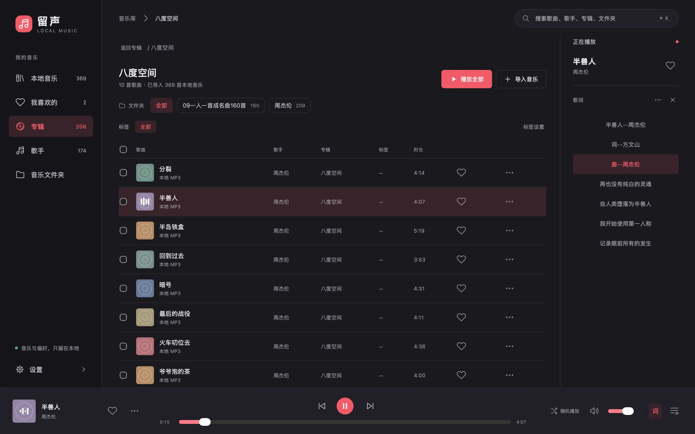
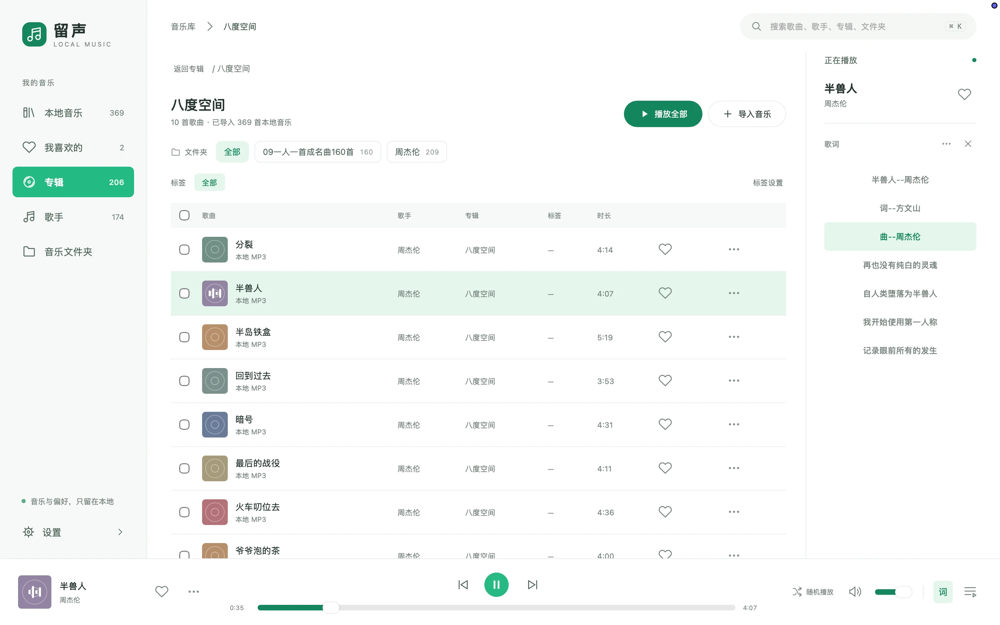

<div align="center">
  
  <h1>留声 · Local Music</h1>
  <p><strong>把喜欢，留在耳边。</strong></p>
  <p>简单的本地 MP3 播放器。打开音乐文件夹，不用登录，离线聆听。</p>
  <p><a href="https://caravel-music.pages.dev">官网</a> · <a href="https://github.com/yy36295238/caravel-music/releases/download/v0.1.0/liusheng_0.1.0_macos_universal.dmg">下载 macOS 通用版</a> · <a href="docs/guide.md">使用与开发指南</a> · <a href="https://github.com/yy36295238/caravel-music/issues">反馈问题</a></p>
</div>



## 听歌需要的，刚刚好

- **你自己的曲库**：导入 MP3 文件夹，包含子目录；按来源名称、歌手或专辑查找歌曲。
- **留下喜欢的**：收藏、标签与批量整理，搜索和分页适合日常本地曲库。
- **歌词就在右边**：本地 LRC / 内嵌歌词，跟随高亮、点击定位、单曲时间校准，也可随时收起。
- **顺手控制播放**：播放队列、顺序 / 随机 / 单曲循环；macOS 菜单栏播放器支持暂停、切歌。
- **两种颜色，同样好用**：深色红与清新绿，共用曲库、播放和歌词功能，换肤不中断播放。
- **只留在本地**：无需账号，不复制、不移动、不改写原始 MP3；收藏与播放偏好保存在本机。

<details>
  <summary>看看清新绿皮肤</summary>



</details>

## 下载

| 平台 | 要求 | 获取方式 |
| --- | --- | --- |
| macOS 通用版 | macOS 12+，Apple Silicon / Intel | [下载 DMG · v0.1.0 · 7.4 MB](https://github.com/yy36295238/caravel-music/releases/download/v0.1.0/liusheng_0.1.0_macos_universal.dmg) |
| Windows x64 | Windows 10 / 11、WebView2 | [源码构建指南](docs/guide.md#本地开发和打包)，暂未提供官网安装包 |

macOS：打开 DMG，将「留声」拖入 Applications。当前包为本地签名，尚未经过 Apple 公证；若系统拦截，请确认下载来源后按系统「隐私与安全性」提示处理。

## 开始听歌

1. 添加音乐文件夹，自动收录其中的 MP3。
2. 点歌曲播放；用文件夹按钮、歌手、专辑或搜索定位音乐。
3. 在「设置」中切换皮肤和管理标签；同名 LRC 放在 MP3 旁边即可读取。

留声不提供在线音乐或歌词搜索。移除来源不删除音频文件；刷新会清理缺失歌曲的索引，离线目录或失败扫描会保留记录。

## 开发

Tauri 2 + 原生 JavaScript / CSS + Rust + SQLite，不捆绑 Chromium。

```sh
./run.sh                      # 开发模式
./run.sh build universal dmg  # macOS 通用 DMG
./run.sh clean                # 清理构建缓存，保留 artifacts 中的 DMG
```

完整环境要求、打包、数据目录和自查方式见 [使用与开发指南](docs/guide.md)。

## 官网

官网源码位于 [`site/`](site/)，纯 HTML / CSS / JavaScript，无额外运行时依赖，使用 Cloudflare Pages 托管。

[部署说明与页面参考](docs/website.md) · [产品设计方案](本地音乐播放器设计方案.md)
